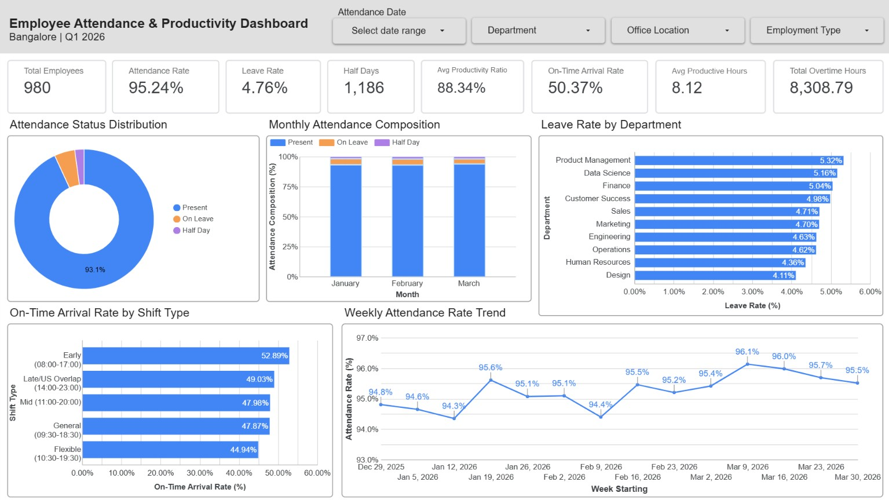
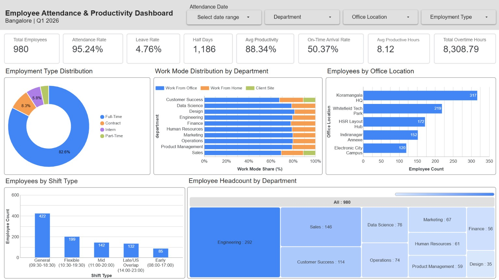
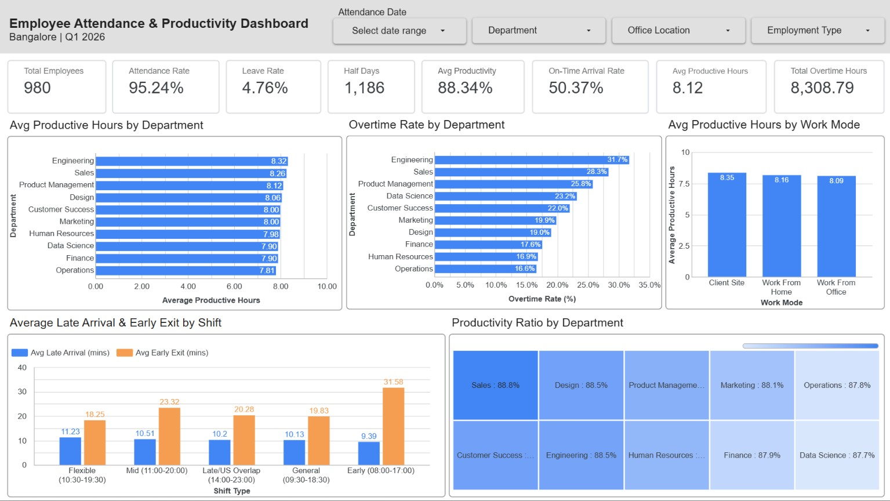

# Employee Attendance & Productivity Analytics

## Project Overview

This project analyzes employee attendance and productivity data for the Bangalore workforce during Q1 2026.

The analysis focuses on attendance, leave patterns, workforce distribution, work modes, productive hours, punctuality, overtime, and department-level performance.

Python was used for data cleaning, exploratory analysis, statistical testing, and KPI calculation. Looker Studio was used to create the final interactive dashboard.

## Quick Links

- [Live Looker Studio Dashboard](https://datastudio.google.com/reporting/f9bf22c0-fc21-4c7c-bb0b-47e8e8098f7a)
- [Data Cleaning Notebook](Data%20Cleaning/Employee_Attendance_Data_Cleaning.ipynb)
- [Data Analysis Notebook](Data%20Analysis/Employee_Attendance_Data_Analysis.ipynb)
- [Full Project Report](Report/Employee_Attendance_Productivity_Analytics_Report.pdf)

---

## Tools Used

- Python
- Pandas
- NumPy
- Matplotlib
- Seaborn
- SciPy
- Google Colab
- Looker Studio

---

## Dataset Overview

- Total Records: 55,374
- Raw Columns: 22
- Cleaned Columns: 26
- Unique Employees: 980
- Departments: 10
- Office Locations: 5

The project includes both the raw dataset and the cleaned dataset used for analysis.

---

## Project Workflow


The project followed an end-to-end analytics workflow, starting with raw data inspection and cleaning, followed by feature engineering, exploratory and statistical analysis, KPI calculation, dashboard development, and final workforce insights.

---

### Workflow Summary

**Data Preparation:** Raw attendance data was inspected, cleaned, standardized, validated, and enhanced with derived fields required for analysis.

**Data Analysis:** Univariate, bivariate, and multivariate analysis were performed along with statistical testing and KPI calculation.

**Dashboard & Reporting:** The analyzed data was transformed into a three-page Looker Studio dashboard, followed by key workforce insights and the final project report.

---

## Data Cleaning

The raw dataset was inspected for duplicate records, missing values, whitespace issues, data types, numerical outliers, date formats, and logical consistency.

The main cleaning steps included:

- Checked the dataset structure, column types, duplicates, and missing values.
- Verified that missing login and logout timestamps were associated with employee leave records.
- Removed unnecessary columns such as `employee_name` and `attendance_id`.
- Cleaned extra spaces and checked categorical values for consistency.
- Converted date and timestamp columns into proper datetime formats.
- Checked numerical columns for outliers, skewness, and unusual values.
- Retained valid late-arrival outliers that represented genuine attendance behaviour.
- Performed employee ID, date, employee attribute, and attendance consistency checks.
- Created useful derived fields for further analysis.
- Exported the final cleaned dataset with 55,374 records and 26 columns.

The derived fields included `attendance_month`, `attendance_weekday`, `tenure_days`, `is_late`, `is_early_exit`, and `productivity_ratio`.

### Data Cleaning Notebook

[View Data Cleaning Notebook](Data%20Cleaning/Employee_Attendance_Data_Cleaning.ipynb)

---

## Exploratory Data Analysis (EDA)

The cleaned dataset was analyzed to understand patterns in attendance, working hours, productivity, punctuality, work modes, departments, and employee distribution.

### Univariate Analysis
Individual variables were examined using histograms, box plots, summary statistics, frequency counts, and categorical charts. Numerical features such as total hours worked, break duration, productive hours, late arrival, early exit, overtime, and productivity ratio were analyzed along with categorical variables such as department, attendance status, and work mode.

### Bivariate Analysis
Relationships between two variables were studied using:
- Total Hours Worked vs Net Productive Hours
- Late Arrival Minutes by Department
- Average Productive Hours by Work Mode
- Work Mode Composition by Department

### Multivariate Analysis
Multiple variables were analyzed together using:
- Pairwise relationship analysis
- Correlation heatmap
- Late Arrival by Department and Work Mode
- Productive Hours Distribution by Department

### Statistical Analysis
Statistical tests were performed to validate selected relationships:
- Pearson Correlation — Total Hours Worked and Net Productive Hours
- Independent t-test — Work Mode and Late Arrival
- One-Way ANOVA — Department and Productive Hours
- Chi-Square Test — Department and Work Mode

### Data Analysis Notebook

[View Data Analysis Notebook](Data%20Analysis/Employee_Attendance_Data_Analysis.ipynb)

---

## Key Performance Indicators

| KPI | Value |
|---|---:|
| Total Employees | 980 |
| Attendance Rate | 95.24% |
| Leave Rate | 4.76% |
| Half Days | 1,186 |
| Avg Productivity Ratio | 88.34% |
| On-Time Arrival Rate | 50.37% |
| Avg Productive Hours | 8.12 hrs |
| Total Overtime Hours | 8,308.79 hrs |

---

## Live Looker Studio Dashboard

[View Interactive Dashboard](https://datastudio.google.com/reporting/f9bf22c0-fc21-4c7c-bb0b-47e8e8098f7a)

---

## Dashboard Preview

### Page 1 — Attendance & Leave



This page focuses on employee attendance, leave behaviour, attendance trends, and punctuality.

**Includes:**
- Attendance Status Distribution
- Monthly Attendance Composition
- Leave Rate by Department
- On-Time Arrival Rate by Shift Type
- Weekly Attendance Rate Trend

---

### Page 2 — Workforce & Work Mode



This page focuses on workforce structure and employee distribution across employment types, work modes, office locations, departments, and shifts.

**Includes:**
- Employee Distribution by Employment Type
- Work Mode Distribution by Department
- Employees by Office Location
- Employees by Shift Type
- Employee Headcount by Department

---

### Page 3 — Productivity & Punctuality



This page focuses on productive working time, overtime, work-mode productivity, and shift-level punctuality.

**Includes:**
- Average Productive Hours by Department
- Overtime Rate by Department
- Average Productive Hours by Work Mode
- Average Late Arrival & Early Exit by Shift
- Productivity Ratio by Department

---

## Key Findings

- Overall attendance rate was 95.24%, while the overall leave rate was 4.76%.
- A total of 1,186 half-day attendance records were recorded during Q1 2026.
- Overall On-Time Arrival Rate was 50.37%, showing that punctuality is an important workforce area to monitor.
- Weekly attendance remained stable throughout the quarter, ranging from approximately 94.3% to 96.1%.
- Engineering had the largest workforce with 292 employees, while Koramangala HQ had the highest office headcount with 317 employees.
- Full-Time employees represented 82.6% of the workforce.
- Average productive hours across departments ranged from 7.81 hours in Operations to 8.32 hours in Engineering.
- Engineering had the highest overtime rate at 31.7%, while Operations had the lowest at 16.6%.
- Client Site recorded the highest average productive hours at 8.35 hours, followed by Work From Home at 8.16 hours and Work From Office at 8.09 hours.
- Productivity ratios remained consistent across departments, ranging from approximately 87.7% to 88.8%.

---

## Project Structure

```text
Employee-Attendance-Productivity-Analytics
│
├── Dashboard
│   ├── Page_1_Attendance_Leave.jpg
│   ├── Page_2_Workforce_Work_Mode.jpg
│   ├── Page_3_Productivity_Punctuality.jpg
│   └── Looker_Studio_Dashboard_Link.txt
│
├── Data Analysis
│   └── employee_attendance_data_analysis.ipynb
│
├── Data Cleaning
│   └── employee_attendance_data_cleaning.ipynb
│
├── Datasets
│   ├── employee_attendance_bangalore_q1_2026.csv
│   └── employee_attendance_bangalore_q1_2026_cleaned.csv
│
├── Report
│   └── Employee_Attendance_Productivity_Analytics_Report.pdf
│
├── .gitignore
└── README.md
```

---

## Project Report

The complete project report contains the project methodology, data preparation, analysis, KPIs, dashboard findings, recommendations, limitations, and conclusion.

[View Full Project Report](Report/Employee_Attendance_Productivity_Analytics_Report.pdf)

---

## Author

**Rosmi Koley**
